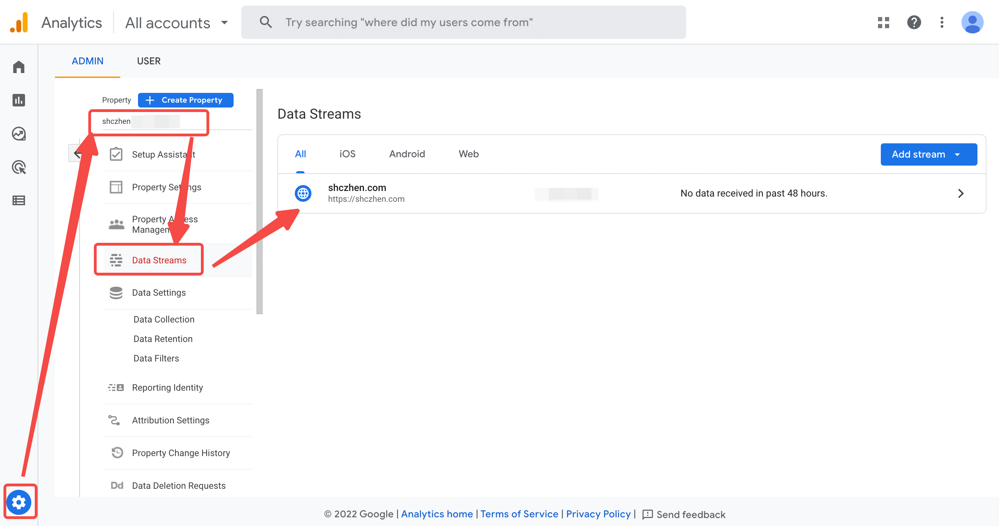
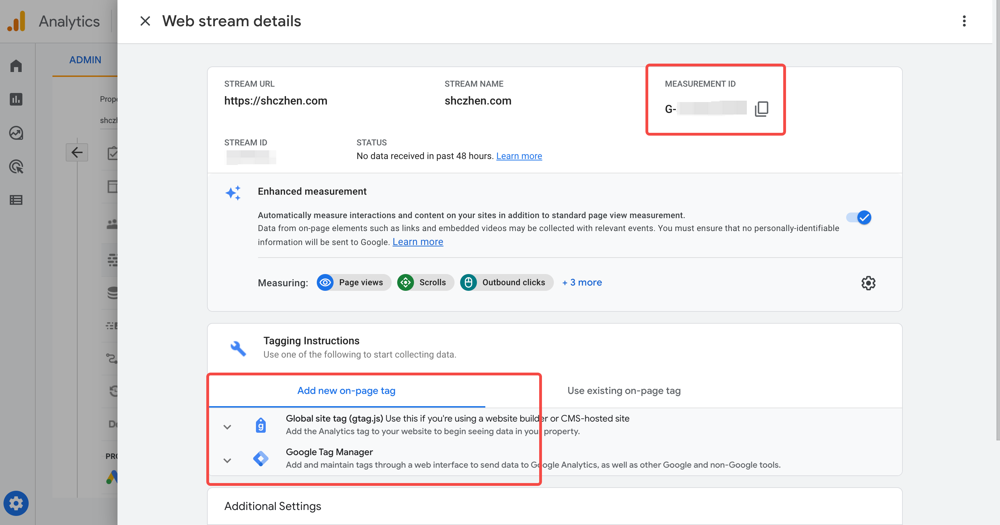
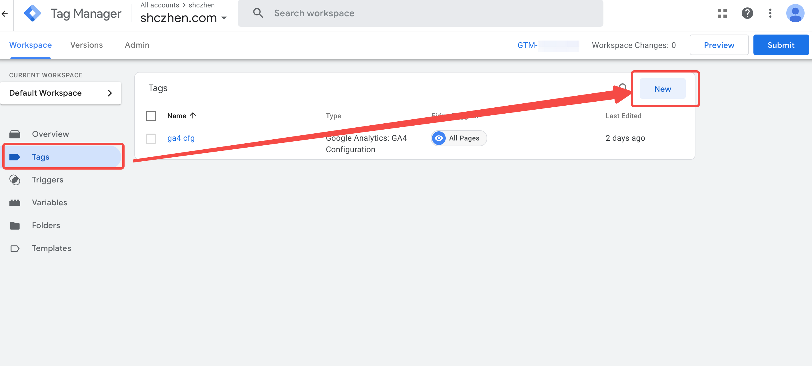
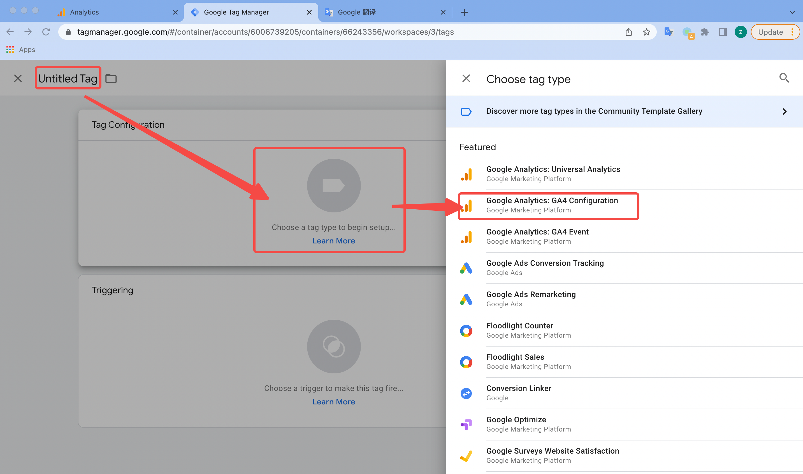
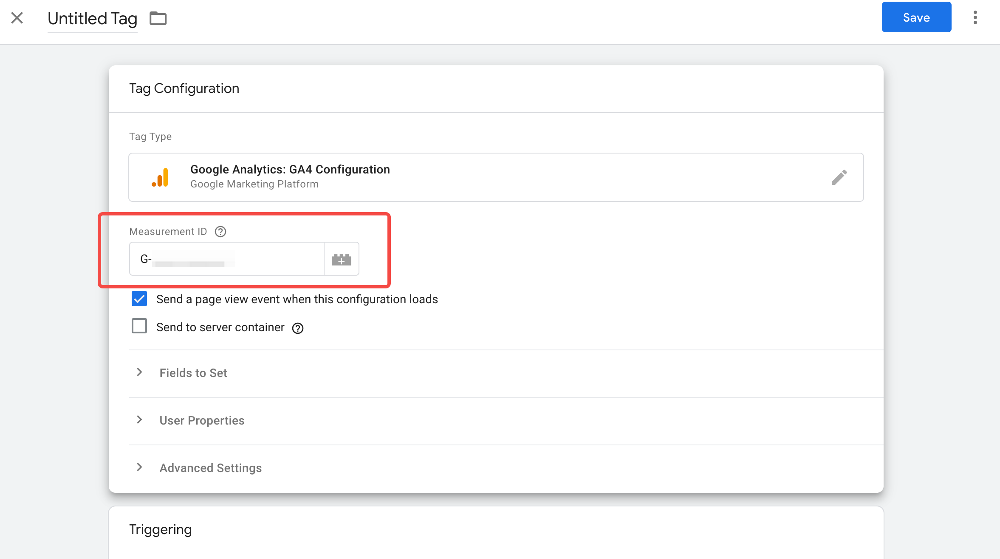
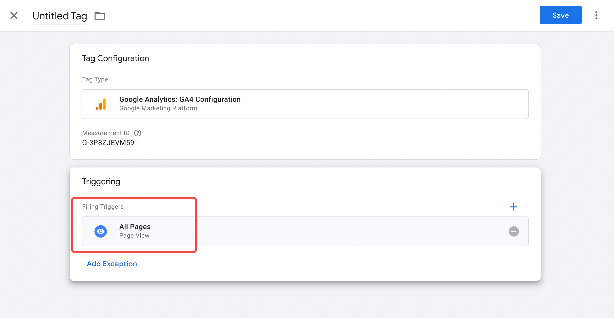

## What's GA4 and Tag Manager?

> Google Analytics 4 is an analytics service that enables you to measure traffic and engagement across your websites and apps.
>
> https://developers.google.com/analytics/devguides/collection/ga4

> Google Tag Manager is a tag management system that includes the same functionality as global site tags, and lets you configure and instantly deploy tags on your website or mobile app from an easy to use web-based user interface.
>
> https://tagmanager.google.com/

In a word, we use GA4 to analyze, and use Tag Manager to manage tags on website.

## Background

We have been using [Universal Analytics](https://support.google.com/analytics/answer/10269537?hl=en) before, which will sunset soon.

For consideration of consistent data in analytics tools, we need to migrate from UA to GA4 as soon as possible.

## Create GA4 account and propertity

For a totaly new commer, just visit https://analytics.google.com/analytics/web/# to create account and propertity.

For existing UA user, follow [this guide](https://support.google.com/analytics/topic/12154439?hl=en&ref_topic=12153943,2986333,) and migrate to GA4.

After created/migrated, you can find your website here:

Click the target data stream, you can find all details:

As you can see, there're two different tagging instructions. It meanings you can directly add `gtag.js` script to your website to collect data, or use Tag Manager.

And the `MEASUREMENT ID` is the identification config.

## Create Tag Manager account and container

> Ignore this section if you don't want to use Tag Manager.

Visit https://tagmanager.google.com/ to create a Tag Manager account and container. The Tag Manager container looks like a instance here, but it contains version control, templates, custom variables and some more features.

We use google `Tag Manager`(hereinafter referred to as `GTM`) to create, debug, and apply tags. 'tag' here is a concept, tags are snippets of code or tracking pixels from third-party tools. These tags tell Google Tag Manager what to do. Examples of common tags within Google Tag Manager are: Google Analytics Universal tracking code or GA4 tracking code.

So that, we need to config the 'link' from GTM to GA4.

Click the `new` button on `Tags` page.

Then choose `Google Analytics: GA4 Configuration` as tag type.

Input the target GA4 Measurement ID here.

For proxy all data to GA4, we choose `All Pages` trigger.

After all settled, you can use GTM container ID instead of GA4 Measurement ID in website `gtag.js` config.

## Integrate config in your website

Do remember that, use your GA4 Measurement ID if you use GA4 only. But if you use GTM and has a GA4 config, you should use GTM container ID instead.

### Plugin

Most of popular website has a gtag plugin. For example:

- [@docusaurus/plugin-google-gtag](https://docusaurus.io/docs/api/plugins/@docusaurus/plugin-google-gtag)
- [gatsby-plugin-google-gtag](https://www.gatsbyjs.com/plugins/gatsby-plugin-google-gtag/)

You can easily config it in your website.

### Scripts

As mentioned above, both GA4 and GTM provide a code snippet for you to insert into HTML. You can find the code in your Admin page.

## Next step

In this scenario, you config the GA4/GTM to analyze your website. The report in GA4 will be available after 48 hours.

There are much more features you may want to apply. We will introduce some helpful or interesting things in future blog. Including but not limited to cross-domain measurement, set of GTM triggers group, etc.
